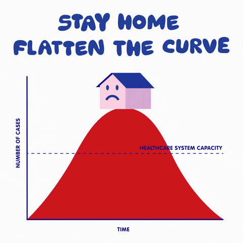

# CP-321-Data-vizualization
### Here is a look at all my work done in Data vizualization course done in while studying at Wilfrid Laurier University under the course CP321
- Topics Learnt:
- - Basics of Vizualization asking the right questions to data (KWL, ASSERT and other common models)
- - gathering the data from Beautiful soup and HTML files
- - Cleaning the data using pandas and Numpy
- - Plotting various kinds of data and inspecting which type of data vizualization is suitable for which scenario
- - Representing and uploading data on web based applications like flask and HTML
- - basics of HTML, CSS, Javascript and Flask
- - PCA and some other common dimensional reductionality concepts
- - Explaining the data and it's insights in the form of a story

### Only 2 assignments were provided to all the students due to the COVID 19 Pandemic
### Group Project created on Province wise vaccine distribution analysis for COVID 19 Pandemic in Canada 
#### Insepcting on which regions should be recieve more emphasis on doses and how to optimally use the vaccine supply prioir to them hitting their expiry date

